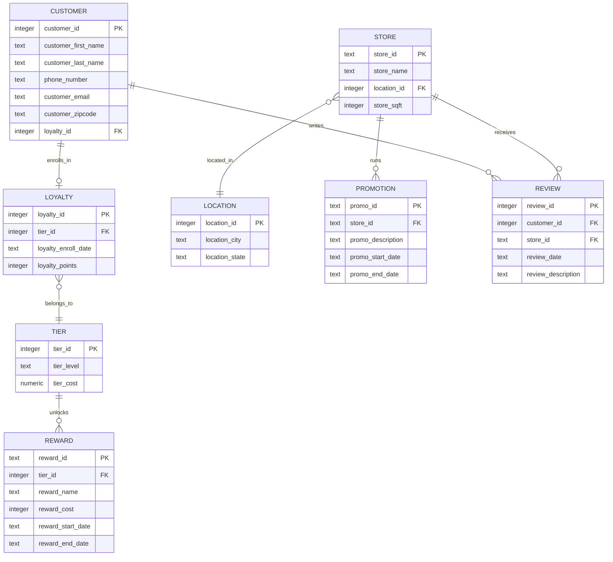

# Entity Relationship Diagram

```mermaid
erDiagram
  CUSTOMER {
    integer customer_id PK
    text customer_first_name
    text customer_last_name
    text phone_number
    text customer_email
    text customer_zipcode
    integer loyalty_id FK
  }

  LOYALTY {
    integer loyalty_id PK
    integer tier_id FK
    text loyalty_enroll_date
    integer loyalty_points
  }

  TIER {
    integer tier_id PK
    text tier_level
    numeric tier_cost
  }

  REWARD {
    text reward_id PK
    integer tier_id FK
    text reward_name
    integer reward_cost
    text reward_start_date
    text reward_end_date
  }

  STORE {
    text store_id PK
    text store_name
    integer location_id FK
    integer store_sqft
  }

  LOCATION {
    integer location_id PK
    text location_city
    text location_state
  }

  PROMOTION {
    text promo_id PK
    text store_id FK
    text promo_description
    text promo_start_date
    text promo_end_date
  }

  REVIEW {
    integer review_id PK
    integer customer_id FK
    text store_id FK
    text review_date
    text review_description
  }

  CUSTOMER ||--o| LOYALTY : enrolls_in
  LOYALTY }o--|| TIER : belongs_to
  TIER ||--o{ REWARD : unlocks
  STORE }o--|| LOCATION : located_in
  STORE ||--o{ PROMOTION : runs
  CUSTOMER ||--o{ REVIEW : writes
  STORE ||--o{ REVIEW : receives
```
